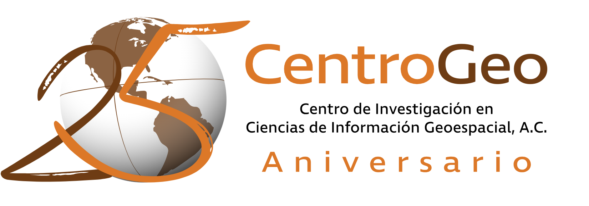

```html
<div style="display: flex; justify-content: space-between;">
    
    
</div>
```

# Proyectos de Investigación en Sistemas y Análisis de Datos Espaciales

## Repositorio de Proyectos

Este repositorio contiene los procesos y datos desarrollados para los proyectos finales de las materias de Sistemas de Información Geográfica, Análisis Espacial y Procesos de Ciencia de Datos Espaciales.

### Proyectos Desarrollados:

1. **Sistemas de Información Geográfica:**
   - **Descripción del Proyecto:** Estimación de zonas potenciales para la captación de agua de lluvia a nivel catastral mediante agrupación por estadística local (HotSpots) en la Ciudad de México (CDMX).
   - **Datos Utilizados:**
     - Datos del catastro de la CDMX.
     - Datos del censo 2020 del INEGI.
     - Consumo de agua por manzana de Sacmex.
   - **Procesos Realizados:**
     - Creación de una base de datos espacial.
     - Obtención de índices de escasez por manzana.
     - Cálculo del RCHP (Potencial de Captura y Recolección de Agua de Lluvia).
     - Análisis de estadística local basado en los resultados finales.

2. **Análisis Espacial:**
   - **Descripción del Proyecto:** Utilización de Análisis de Componentes Principales para obtener un índice de acceso a infraestructura de agua en base a los datos del censo 2020 del INEGI.
   - **Variables Consideradas:**
     - Distribución de agua por tandeos.
     - Acceso a agua entubada.
     - Acceso a drenaje.
     - Acceso a cisterna.
     - Acceso a tinaco.
   - **Métodos Aplicados:**
     - Interpolación geoestadística espacial Kriging con datos de las EMAS (Estaciones Meteorológicas Automatizadas) de la CONAGUA para la determinación del promedio de precipitación en la CDMX a 30 años.

3. **Procesos de Ciencia de Datos Espaciales:**
   - **Descripción del Proyecto:** Georreferenciación de zonas con problemáticas de agua utilizando técnicas de webscraping y geocoding para crear una base de datos espacial actualizada.
   - **Desarrollo Tecnológico:**
     - Creación de una app móvil para el levantamiento de datos geoespaciales.
     - Actualización de la base de datos espacial para el reporte de problemáticas de agua.
     - Desarrollo de un mapa web con simbología basada en la clusterización de los datos para analizar zonas con conflictos de agua.

Estos proyectos abordan diversos aspectos de la gestión y análisis de información geoespacial, aplicando técnicas avanzadas para resolver problemáticas reales en el ámbito del agua y su distribución.